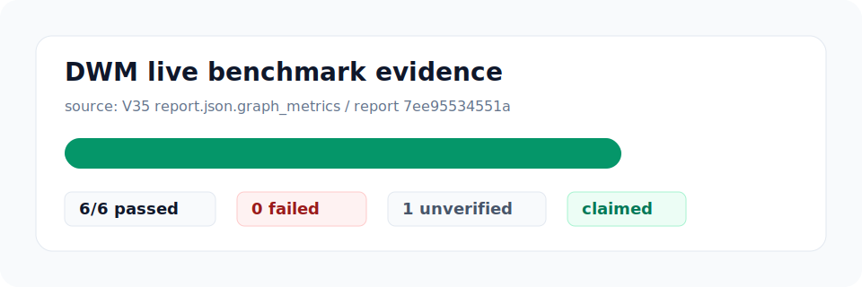

# DWM

> Deterministic Workflow Machine: a local control-plane for agentic work that
> turns large goals into hashed plans, packets, evidence, reviews, gates, and
> resumable runtime state.

[](LICENSE)
[](SKILL.md)
[](https://github.com/Moonweave-Systems/dwm/releases)
[](scripts/check_contract.py)


**DWM** is a deterministic workflow control-plane for Codex-era agentic work.
It sits above agent CLIs and local harnesses, records every important decision
as an artifact, and refuses to blur planned work with executed work.

The installed skill remains named `dynamic-workflow-designer` for compatibility,
but the product surface is broader: workflow design, packet compilation,
bounded runner gates, review/repair evidence, live scoring artifacts, adapter
parity checks, daily operator state, and release candidate checks.

Use DWM when the question is not just "what should the agent do next?", but
"what can be resumed, verified, reviewed, blocked, or released from evidence?"

## Quickstart

Run the local demo first. It is the fastest way to see the product loop without
executing live adapters or mutating source files:

```bash
python scripts/dwm_demo.py run --out out/demo/quickstart
python scripts/dwm_demo.py inspect --demo out/demo/quickstart
```

This writes `demo.json`, `status.json`, `README.md`, `demo-inspect.json`, and
`demo-summary.md` under
`out/demo/quickstart` while leaving source files untouched. It demonstrates the
plan, compile, packet-review, adapter-parity, dogfood, daily-operator, and
release-candidate surfaces without live adapter execution. Inspect blocks stale
or incomplete demo artifacts instead of silently refreshing them.

Then use the skill when a task is too large or risky for one normal agent turn:

```text
Use $dynamic-workflow-designer to design a workflow for auditing every route for missing authorization.
```

## Normal Loop

For day-to-day use, DWM works as a local operator loop:

1. design or resume a workflow,
2. inspect the next safe action,
3. run only the approved bounded step,
4. review evidence before claiming progress,
5. cut release candidates only from coherent artifacts.

Inspect an existing run:

```bash
python scripts/dwm.py status --run out/v9/v32-semantic-dogfood
python scripts/dwm.py next --run out/v9/v32-semantic-dogfood
python scripts/dwm.py doctor
python scripts/dwm.py commands --kind product
```

Run the release contract before publishing changes:

```bash
python scripts/check_contract.py
```

For the full release command corpus, use:

```bash
python scripts/dwm.py commands --kind release
```

## What Exists Today

| Layer | Capability |
| --- | --- |
| Design | Converts broad objectives into phases, workers, handoffs, gates, budgets, and verification plans. |
| Compile | Emits first-slice packets, prompts, status, resume files, and hash ledgers. |
| Run | Executes approved read-only or pre-isolated packets through bounded adapters. |
| Review | Records review findings, repair prompts, retry state, and verification evidence. |
| Fanout | Runs bounded multi-worker slices with deterministic fan-in. |
| HUD | Produces read-only status views and hash-bound approval artifacts. |
| Live evidence | Plans adapter commands, preflights them, ingests receipts, judges receipts, scores verified evidence, and reports graph-ready metrics. |
| Packaging | Validates repo-local install metadata, adapter registries, compatibility, and release evidence. |

## What Is Still Honest

| Claim | Current status |
| --- | --- |
| Local artifact loop | Implemented and covered by the canonical demo. |
| Adapter parity | Implemented as a support matrix and blocker, not a live parity claim. |
| Release candidate | Implemented from daily operator and adapter parity evidence. |
| Benchmark graph | Source-bound graph artifacts exist, but public trend promotion requires real release history. |
| Direct-agent superiority | Not claimed. Future comparison must come from measured dogfood attempts. |
| Unrestricted autonomy | Not claimed. Risky work remains gate-bound by default. |

## Safety Model

DWM treats artifacts, not model claims, as the source of truth. A workflow is
trusted only when the relevant plan, packet, prompt, evidence, review, approval,
and status artifacts match their hash ledgers.

DWM does not claim unrestricted autonomous execution. Destructive actions,
network access, dependency installation, secret access, external messaging,
database migration, production deployment, and history rewrite require explicit
gates with a safe default.

## Live Scoring



The live benchmark path is intentionally staged:

```text
V28 command plan
  -> V29 runner preflight
  -> V30 receipt ingestion
  -> V31 receipt judgment
  -> V32 score verification
  -> V33 score aggregation
  -> V34 adversarial review
  -> V35 benchmark report
  -> V36 README graph artifacts
```

The README graph pipeline is source-bound. Benchmark visuals read
`report.json.graph_metrics`, not terminal output, generated prose, or manually
copied numbers. The tracked README image in `assets/dwm-live-benchmark.svg` is a
published snapshot of the V36 graph artifact and keeps its source hash in
`assets/dwm-live-benchmark.json`.

Trend graphs require a history ledger, not one-off evidence. V38 records
distinct report snapshots into `history.json` and `trend.svg` so a later README
growth chart can be promoted only when the data supports it.
V39 adds the promotion gate: at least three release-kind snapshots, unique
report hashes, a non-decreasing score sequence, and a minimum improvement.
V40 records the release snapshots themselves as `snapshot.json` files bound to a
release id, git commit, score metrics, and report hash.
V41 collects release snapshots into a sorted `series.json` and generates the V38
history ledger without manually selecting benchmark points.
V42 turns a promotion-ready series into `candidate.json`, the final pre-publish
artifact before any README asset changes.
V43 records the direction checkpoint and next roadmap so graph publication stays
tied to real evidence, review gates, and operator value.
V44 reviews a candidate into `candidate-review.json`, emits
`publish-checklist.md`, and blocks unsupported public benchmark claims before
README asset promotion.
V45 turns an approved review into an `asset-promotion.json` bundle with
`asset-diff.md` for human inspection before tracked asset changes.
V46 records long-run workflow packets in `queue.json` and emits `next-action.md`
so DWM can continue from the next safe action or a precise blocked reason.
V47 records a local dogfood corpus in `dogfood-corpus.json`, emits
`queue-packets.json`, and keeps direct/DWM comparison slots as `not-run` until
later measured attempts exist.
V48 emits `operator-loop.json` and `today.md` so daily work can start from the
next safe queue action or a precise blocked reason.
V49 records `adapter-parity.json` and `adapter-parity.md` so Codex, Claude,
shell, and fixture support stays honest about supported, planned, and
unsupported actions before any live adapter execution.
V50 records `release-candidate.json`, `release-notes.md`, and
`release-checklist.md` from coherent V48/V49 evidence before any public release.
V51 records `demo.json`, `status.json`, and `README.md` for the canonical local
demo so new users can see the full artifact loop first.
V52 reorganizes the README around the quick demo, normal loop, current honesty
boundaries, and benchmark-readiness caveats before adding any new graph claims.
V53 records `demo-inspect.json` and `demo-summary.md` so demo output can be
checked for missing artifacts and hash drift before a user trusts the result.
V54 records `dogfood-attempts.json` and `comparison-ledger.json` from measured
local attempt receipts so future graphs can start from evidence instead of
claims.
V55 records `adapter-live-matrix.json` and `adapter-live-matrix.md` so local
Codex, Claude, and OpenCode command availability can be inspected without task
execution or secret access.
V56 records `measurement.json`, `attempts.json`, and linked dogfood ledgers for
the first real DWM-controlled local measurement point without filling direct
Codex comparison slots.
V57 records `comparison-pair.json`, `comparison-pair.md`, and
`pair-status.json` only when a direct Codex receipt has a human gate, matching
task id, evidence, and no public superiority claim.
V58 records `pair-series.json`, `pair-series.md`, and `graph-readiness.json` so
comparison pairs can be accumulated while graph promotion stays blocked until
enough evidence exists.
V59 records `chart-candidate.json`, `chart-candidate.md`, and `chart-data.csv`
only from graph-ready local pair series, while README graph promotion remains
human-review gated.
V60 records `chart-review.json` and `chart-review.md` only when a human review
receipt approves the chart candidate hash without public benchmark claims.
V61 adds `scripts/dwm_dogfood_acquire.py` so one command can run the local
measurement, stop with a direct receipt template, or continue through pair,
series, and chart-candidate updates when a human-gated receipt is supplied. It
writes `acquisition.json`, `acquisition.md`, and `direct-receipt-template.json`
when direct evidence is still needed.
V62 adds `scripts/dwm_dogfood_operator.py` so the next dogfood step is selected
from existing pair and acquisition artifacts instead of being guessed manually.
It writes `dogfood-operator.json`, `dogfood-operator.md`, and `status.json`.
V63 makes that operator duplicate-aware: if a pair root has more than one pair
for the same task, it blocks graph-ready recommendation with
`ERR_DOGFOOD_OPERATOR_DUPLICATE_TASK`.
V64 adds `scripts/dwm_dogfood_pair_select.py` so duplicate pair roots can be
resolved without deleting evidence by creating a clean selected root and V58
series.
V65 adds `scripts/dwm_dogfood_chart_render.py` so only a human-reviewed local
chart candidate can produce `chart-render.json`, `chart-render.svg`, and
`chart-render.md`.

Generate graph artifacts with:

```bash
python scripts/dwm_readme_benchmark_graph.py generate --report out/live-reports/<report_id> --out out/readme-benchmark-graphs/<graph_id>
```

This writes:

- `benchmark-graph.json`
- `benchmark-graph.svg`
- `README-snippet.md`

The benchmark promotion gate writes `promotion.json`, `promoted-trend.svg`, and
its own `README-snippet.md` only after the history clears the public-claim
policy.

## Common Commands

Product shell:

```bash
python scripts/dwm.py plan "<objective>" --out out/v21/<run_id>
python scripts/dwm.py run "<objective>" --out out/v21/<run_id>
python scripts/dwm.py resume --run out/v21/<run_id>
```

Benchmark and live evidence:

```bash
python scripts/dwm_benchmark.py corpus
python scripts/dwm_benchmark.py claim --min-margin 8
python scripts/dwm_live_benchmark.py capture --out out/benchmarks-live/<capture_id>
python scripts/dwm_live_attempt_plan.py plan --adapter-command codex --task-id failing-test-fix --out out/live-attempt-plans/<plan_id>
python scripts/dwm_live_runner_preflight.py preflight --plan out/live-attempt-plans/<plan_id> --out out/live-runner-preflight/<preflight_id>
python scripts/dwm_live_receipt.py ingest --preflight out/live-runner-preflight/<preflight_id> --receipt receipt.json --out out/live-receipts/<receipt_id>
python scripts/dwm_live_report.py publish --review out/live-score-reviews/<review_id> --out out/live-reports/<report_id>
python scripts/dwm_benchmark_snapshot.py record --report out/live-reports/<report_id> --release-id <release_id> --out out/benchmark-snapshots/<snapshot_id>
python scripts/dwm_benchmark_series.py build --snapshot-root out/benchmark-snapshots --out out/benchmark-series/<series_id>
python scripts/dwm_benchmark_candidate.py make --series out/benchmark-series/<series_id> --out out/benchmark-candidates/<candidate_id>
python scripts/dwm_benchmark_candidate_review.py review --candidate out/benchmark-candidates/<candidate_id> --out out/benchmark-candidate-reviews/<review_id>
python scripts/dwm_readme_asset_promotion.py promote --review out/benchmark-candidate-reviews/<review_id> --out out/readme-asset-promotions/<promotion_id>
python scripts/dwm_workflow_queue.py create --packets packets.json --out out/workflow-queues/<queue_id>
python scripts/dwm_workflow_queue.py resume --queue out/workflow-queues/<queue_id>
python scripts/dwm_dogfood_corpus.py record --out out/dogfood-corpus/<corpus_id>
python scripts/dwm_dogfood_attempts.py record --corpus out/dogfood-corpus/<corpus_id> --attempts attempts.json --out out/dogfood-attempts/<attempt_id>
python scripts/dwm_dogfood_measure.py sample --out out/dogfood-measurements/<measurement_id>
python scripts/dwm_dogfood_pair.py pair --dwm-measure out/dogfood-measurements/<measurement_id> --direct-receipt direct-receipt.json --out out/dogfood-pairs/<pair_id>
python scripts/dwm_dogfood_pair_series.py build --pair-root out/dogfood-pairs --out out/dogfood-pair-series/<series_id>
python scripts/dwm_dogfood_chart_candidate.py candidate --series out/dogfood-pair-series/<series_id> --out out/dogfood-chart-candidates/<chart_id>
python scripts/dwm_dogfood_chart_review.py review --candidate out/dogfood-chart-candidates/<chart_id> --receipt review-receipt.json --out out/dogfood-chart-reviews/<review_id>
python scripts/dwm_dogfood_acquire.py acquire --task-id <task_id> --out out/dogfood-acquisitions/<acquisition_id>
python scripts/dwm_dogfood_operator.py recommend --out out/dogfood-operator/<operator_id>
python scripts/dwm_dogfood_pair_select.py select --pair-root out/dogfood-pairs --out out/dogfood-pair-selections/<selection_id>
python scripts/dwm_dogfood_chart_render.py render --review out/dogfood-chart-reviews/<review_id> --out out/dogfood-chart-renders/<render_id>
python scripts/dwm_daily_operator.py today --corpus out/dogfood-corpus/<corpus_id> --out out/daily-operator/<operator_id>
python scripts/dwm_benchmark_history.py build --report out/live-reports/<report_id> --out out/benchmark-history/<history_id>
python scripts/dwm_benchmark_promotion.py promote --history out/benchmark-history/<history_id> --out out/benchmark-promotions/<promotion_id>
```

Role, HUD, install, adapter, and release checks:

```bash
python scripts/dwm_roles.py registry
python scripts/dwm_hud.py approve --hud out/hud/<hud_id> --out out/hud/<approval_id> --approver <name>
python scripts/dwm_install.py validate
python scripts/dwm_adapters.py registry
python scripts/dwm_adapters.py parity --out out/adapters/<parity_id>
python scripts/dwm_adapter_live_matrix.py matrix --out out/adapter-live-matrix/<matrix_id>
python scripts/dwm_release_candidate.py cut --parity out/adapters/<parity_id> --operator out/daily-operator/<operator_id> --out out/release-candidates/<candidate_id>
python scripts/dwm_release.py status --out out/release/<release_id>
```

## Repository Map

| Path | Purpose |
| --- | --- |
| `SKILL.md` | Codex skill entrypoint and workflow design contract. |
| `scripts/dwm.py` | Product CLI for status, next actions, doctor, and command discovery. |
| `scripts/dwm_demo.py` | Canonical local demo and inspect summary without live adapters. |
| `scripts/check_contract.py` | Release contract smoke and documentation consistency check. |
| `scripts/compile_workflow.py` | First-slice packet compiler. |
| `scripts/dwm_runner.py` | Runner, session/worktree, review/repair, and fanout surfaces. |
| `scripts/dwm_live_*.py` | Live evidence, receipt, score, review, report, and graph gates. |
| `scripts/dwm_benchmark_snapshot.py` | Release benchmark snapshot recorder. |
| `scripts/dwm_benchmark_series.py` | Release snapshot series builder. |
| `scripts/dwm_benchmark_candidate.py` | Promotion-ready benchmark publish candidate workflow. |
| `scripts/dwm_benchmark_candidate_review.py` | Benchmark candidate review gate before README asset promotion. |
| `scripts/dwm_readme_asset_promotion.py` | README benchmark asset promotion bundle and diff summary. |
| `scripts/dwm_workflow_queue.py` | Long-run workflow queue and next safe action selector. |
| `scripts/dwm_dogfood_corpus.py` | Local dogfood task corpus recorder with comparison placeholders. |
| `scripts/dwm_dogfood_attempts.py` | Measured local dogfood comparison ledger. |
| `scripts/dwm_dogfood_measure.py` | Measured local dogfood sample runner. |
| `scripts/dwm_dogfood_pair.py` | Human-gated direct Codex versus DWM comparison pair. |
| `scripts/dwm_dogfood_pair_series.py` | Dogfood pair series and graph-readiness gate. |
| `scripts/dwm_dogfood_chart_candidate.py` | Local dogfood chart candidate gate. |
| `scripts/dwm_dogfood_chart_review.py` | Human-reviewed local dogfood chart gate. |
| `scripts/dwm_dogfood_acquire.py` | One-command dogfood evidence acquisition loop. |
| `scripts/dwm_dogfood_operator.py` | Next dogfood acquisition recommendation loop. |
| `scripts/dwm_dogfood_pair_select.py` | Clean pair-root selector for duplicate task pairs. |
| `scripts/dwm_dogfood_chart_render.py` | Reviewed local dogfood chart renderer. |
| `scripts/dwm_daily_operator.py` | Daily operator loop for ready, blocked, and freshness state. |
| `scripts/dwm_adapters.py` | Adapter registry, normalized evidence, and parity matrix checks. |
| `scripts/dwm_adapter_live_matrix.py` | Local adapter command availability and auth-assumption matrix. |
| `scripts/dwm_release_candidate.py` | Release candidate cut from parity and operator evidence. |
| `scripts/dwm_benchmark_history.py` | Benchmark history ledger and trend graph builder. |
| `scripts/dwm_benchmark_promotion.py` | Benchmark trend promotion gate for public graph claims. |
| `docs/automation-roadmap.md` | Implementation roadmap and completed slices. |
| `docs/v32-to-v35-live-scoring-workflow.md` | Live scoring workflow design. |
| `docs/v36-readme-benchmark-graph-spec.md` | README benchmark graph artifact contract. |
| `fixtures/` | Deterministic manifests used by release gates. |
| `assets/` | Tracked README visuals and published benchmark graph snapshots. |

## Key Docs

- [`docs/spec.md`](docs/spec.md): product spec and release criteria.
- [`docs/automation-roadmap.md`](docs/automation-roadmap.md): staged roadmap.
- [`docs/github-research.md`](docs/github-research.md): prior-art survey.
- [`docs/v12-to-v20-final-roadmap.md`](docs/v12-to-v20-final-roadmap.md): final-product roadmap.
- [`docs/v23-harness-benchmark-spec.md`](docs/v23-harness-benchmark-spec.md): benchmark corpus contract.
- [`docs/v35-live-report-spec.md`](docs/v35-live-report-spec.md): live benchmark report gate.
- [`docs/v36-readme-benchmark-graph-spec.md`](docs/v36-readme-benchmark-graph-spec.md): README graph artifact generator.
- [`docs/v37-readme-public-page-spec.md`](docs/v37-readme-public-page-spec.md): README public page and graph publish gate.
- [`docs/v38-benchmark-history-spec.md`](docs/v38-benchmark-history-spec.md): benchmark history ledger and trend graph gate.
- [`docs/v39-benchmark-promotion-spec.md`](docs/v39-benchmark-promotion-spec.md): public benchmark trend promotion gate.
- [`docs/v40-benchmark-snapshot-spec.md`](docs/v40-benchmark-snapshot-spec.md): release benchmark snapshot recorder.
- [`docs/v41-benchmark-series-spec.md`](docs/v41-benchmark-series-spec.md): release snapshot series builder.
- [`docs/v42-benchmark-candidate-spec.md`](docs/v42-benchmark-candidate-spec.md): benchmark publish candidate workflow.
- [`docs/v43-direction-check-roadmap.md`](docs/v43-direction-check-roadmap.md): direction check and V44-V50 roadmap.
- [`docs/v44-candidate-review-gate-spec.md`](docs/v44-candidate-review-gate-spec.md): benchmark candidate review gate.
- [`docs/v45-readme-asset-promotion-spec.md`](docs/v45-readme-asset-promotion-spec.md): README asset promotion bundle.
- [`docs/v46-long-run-workflow-queue-spec.md`](docs/v46-long-run-workflow-queue-spec.md): long-run workflow queue.
- [`docs/v47-real-dogfood-corpus-spec.md`](docs/v47-real-dogfood-corpus-spec.md): real local dogfood corpus.
- [`docs/v48-daily-operator-loop-spec.md`](docs/v48-daily-operator-loop-spec.md): daily operator loop.
- [`docs/v49-adapter-parity-matrix-spec.md`](docs/v49-adapter-parity-matrix-spec.md): adapter parity matrix.
- [`docs/v50-release-candidate-cut-spec.md`](docs/v50-release-candidate-cut-spec.md): release candidate cut.
- [`docs/v51-canonical-demo-spec.md`](docs/v51-canonical-demo-spec.md): canonical local demo.
- [`docs/v52-readme-ux-spec.md`](docs/v52-readme-ux-spec.md): README UX consolidation.
- [`docs/v53-demo-inspect-spec.md`](docs/v53-demo-inspect-spec.md): demo inspect surface.
- [`docs/v54-dogfood-attempts-spec.md`](docs/v54-dogfood-attempts-spec.md): measured dogfood comparison ledger.
- [`docs/v55-adapter-live-matrix-spec.md`](docs/v55-adapter-live-matrix-spec.md): adapter live availability matrix.
- [`docs/v56-dogfood-measure-spec.md`](docs/v56-dogfood-measure-spec.md): measured local dogfood sample runner.
- [`docs/v57-dogfood-pair-spec.md`](docs/v57-dogfood-pair-spec.md): human-gated dogfood comparison pair.
- [`docs/v58-dogfood-pair-series-spec.md`](docs/v58-dogfood-pair-series-spec.md): dogfood pair series and graph-readiness gate.
- [`docs/v59-dogfood-chart-candidate-spec.md`](docs/v59-dogfood-chart-candidate-spec.md): local dogfood chart candidate gate.
- [`docs/v60-dogfood-chart-review-spec.md`](docs/v60-dogfood-chart-review-spec.md): human-reviewed local dogfood chart gate.
- [`docs/v61-dogfood-acquire-spec.md`](docs/v61-dogfood-acquire-spec.md): one-command dogfood evidence acquisition loop.
- [`docs/v62-dogfood-operator-spec.md`](docs/v62-dogfood-operator-spec.md): next dogfood acquisition recommendation loop.
- [`docs/v63-dogfood-operator-duplicate-root-spec.md`](docs/v63-dogfood-operator-duplicate-root-spec.md): duplicate pair-root blocking for graph readiness.
- [`docs/v64-dogfood-pair-select-spec.md`](docs/v64-dogfood-pair-select-spec.md): clean pair-root selector for duplicate task pairs.
- [`docs/v65-dogfood-chart-render-spec.md`](docs/v65-dogfood-chart-render-spec.md): reviewed local dogfood chart renderer.

Generated `out/` directories are verification evidence, not source of truth.

## Position

DWM is not a prompt-only workflow router and not a clone of any one runtime.
DWM is a deterministic control-plane above agent CLIs, local harnesses, and
bounded adapter surfaces. The goal is to make agentic work inspectable,
reproducible, resumable, and honest about what has actually been executed.

## License

MIT. See [`LICENSE`](LICENSE).
