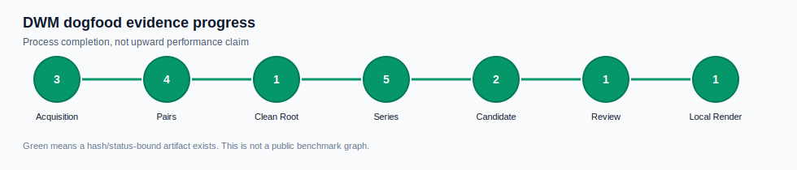

# Keelplane

> A deterministic control-plane for large AI-native work.

[](LICENSE)
[](SKILL.md)
[](https://github.com/Moonweave-Systems/dwm/releases)
[](scripts/check_contract.py)


**Keelplane** sits above agent CLIs, skills, plugins, and local harnesses. It
records every important decision as an artifact and refuses to blur planned
work with executed work.

The installed skill remains named `dynamic-workflow-designer` for compatibility,
and the internal engine remains **DWM Core**: the Deterministic Workflow
Machine. The product surface is broader than one skill: workflow design, packet
compilation, bounded runner gates, review/repair evidence, live scoring
artifacts, adapter parity checks, daily operator state, and release candidate
checks.

Use Keelplane when the question is not just "what should the agent do next?",
but "what can be resumed, verified, reviewed, blocked, or released from
evidence?"

## Quickstart

Run the local demo first. It is the fastest way to see the product loop without
executing live adapters or mutating source files:

```bash
python scripts/dwm_demo.py run --out out/demo/quickstart
python scripts/dwm_demo.py inspect --demo out/demo/quickstart
```

This writes `demo.json`, `status.json`, `README.md`, `demo-inspect.json`, and
`demo-summary.md` under
`out/demo/quickstart` while leaving source files untouched. It demonstrates the
plan, compile, packet-review, adapter-parity, dogfood, daily-operator, and
release-candidate surfaces without live adapter execution. Inspect blocks stale
or incomplete demo artifacts instead of silently refreshing them.

Then use the skill when a task is too large or risky for one normal agent turn:

```text
Use $dynamic-workflow-designer to design a workflow for auditing every route for missing authorization.
```

## Normal Loop

For day-to-day use, Keelplane works as a local operator loop:

1. design or resume a workflow,
2. inspect the next safe action,
3. run only the approved bounded step,
4. review evidence before claiming progress,
5. cut release candidates only from coherent artifacts.

Inspect an existing run:

```bash
python scripts/dwm.py status --run out/v9/v32-semantic-dogfood
python scripts/dwm.py next --run out/v9/v32-semantic-dogfood
python scripts/dwm.py doctor
python scripts/dwm.py commands --kind product
```

Render the current Control Deck when V88-V93 evidence artifacts exist:

```bash
python scripts/dwm_workflow_narrative.py render --out out/workflow-narratives/local
python scripts/dwm_control_deck_score.py score --out out/control-deck-scores/local
python scripts/dwm_control_deck_score_history.py build --score out/control-deck-scores/local --out out/control-deck-score-history/local
python scripts/dwm_metric_ladder.py assess --history out/control-deck-score-history/local/control-deck-score-history.json --out out/metric-ladders/local
python scripts/dwm_benchmark_readiness.py assess --ladder out/metric-ladders/local/metric-ladder.json --out out/benchmark-readiness/local
python scripts/dwm_wave_operator.py select --readiness out/benchmark-readiness/local/benchmark-readiness.json --activation out/workflow-activations/v90-canonical/workflow-activation.json --out out/wave-operators/local
```

The Control Deck may say things like `Chart: roadmap reconciled`, `Gate:
command safety clear`, and `Oracle: evidence claims verified`. Those labels are
status rendering only; artifacts and source hashes remain the source of truth.
The Control Deck score is operator readiness, not a public benchmark or upward
trend claim. The score history can render an internal readiness SVG, but it is
still not a public benchmark graph. The Metric Ladder states which graph level
is currently supported before any benchmark claim is made. Benchmark Readiness
records the current internal score and keeps README benchmark publication
blocked until promotion evidence exists. The Wave Operator selects the next
source-only product wave from readiness and activation evidence.

Run the release contract before publishing changes:

```bash
python scripts/check_contract.py --tier changed
python scripts/check_readme_quality.py README.md
```

For the full release command corpus, use:

```bash
python scripts/check_contract.py
python scripts/dwm.py commands --kind release
```

## What Exists Today

| Layer | Capability |
| --- | --- |
| Design | Converts broad objectives into phases, workers, handoffs, gates, budgets, and verification plans. |
| Compile | Emits first-slice packets, prompts, status, resume files, and hash ledgers. |
| Run | Executes approved read-only or pre-isolated packets through bounded adapters. |
| Review | Records review findings, repair prompts, retry state, and verification evidence. |
| Fanout | Runs bounded multi-worker slices with deterministic fan-in. |
| HUD | Produces read-only status views and hash-bound approval artifacts. |
| Live evidence | Plans adapter commands, preflights them, ingests receipts, judges receipts, scores verified evidence, and reports graph-ready metrics. |
| Control Deck | Renders artifact-backed Chart, Gate, Activation, Oracle, and Next move status without claiming autonomous execution. |
| Readiness score | Scores Control Deck completeness for operator status without claiming benchmark progress. |
| Readiness history | Records Control Deck score movement as internal operator history without publishing benchmark claims. |
| Metric Ladder | Separates process, operator-readiness, and public-benchmark graph levels so metrics can grow without overclaiming. |
| Benchmark readiness | Reports internal readiness and public benchmark publication state without granting README publication approval. |
| Wave Operator | Selects the next source-only product wave and keeps public benchmark publication behind human review. |
| Packaging | Validates repo-local install metadata, adapter registries, compatibility, and release evidence. |

## What Is Still Honest

| Claim | Current status |
| --- | --- |
| Local artifact loop | Implemented and covered by the canonical demo. |
| Adapter parity | Implemented as a support matrix and blocker, not a live parity claim. |
| Release candidate | Implemented from daily operator and adapter parity evidence. |
| Benchmark graph | Source-bound graph artifacts exist, but public trend promotion requires real release history. |
| Direct-agent superiority | Not claimed. Future comparison must come from measured dogfood attempts. |
| Unrestricted autonomy | Not claimed. Risky work remains gate-bound by default. |

## Safety Model

Keelplane treats artifacts, not model claims, as the source of truth. A
workflow is trusted only when the relevant plan, packet, prompt, evidence,
review, approval, and status artifacts match their hash ledgers.

Keelplane does not claim unrestricted autonomous execution. Destructive actions,
network access, dependency installation, secret access, external messaging,
database migration, production deployment, and history rewrite require explicit
gates with a safe default.

## Evidence Graphs

### Process Progress



This graph tracks whether the local evidence pipeline has produced hash-bound
artifacts for each stage. It is allowed to move sideways or reveal blocked work.
It is not a public benchmark graph and does not claim upward performance.

### Benchmark Evidence


Benchmark visuals are source-bound. They read `report.json.graph_metrics`, not
terminal output, generated prose, or manually copied numbers. Trend promotion is
blocked until release history supports the claim; public trend promotion
requires real release history.

## Command Reference

Most readers need only the demo and product shell commands above. The full CLI
surface is kept in [`docs/command-reference.md`](docs/command-reference.md) so
this page stays readable:

- product shell and release checks,
- live evidence and benchmark gates,
- dogfood comparison and process graph commands,
- repository map and generated artifact names.

Generated `out/` directories are verification evidence, not source of truth.

## Documentation

- [`docs/spec.md`](docs/spec.md): product spec and release criteria.
- [`docs/automation-roadmap.md`](docs/automation-roadmap.md): staged roadmap.
- [`docs/command-reference.md`](docs/command-reference.md): full command and artifact reference.
- [`docs/release-history.md`](docs/release-history.md): versioned implementation history.
- [`docs/v12-to-v20-final-roadmap.md`](docs/v12-to-v20-final-roadmap.md): final-product roadmap.

## Position

Keelplane is not a prompt-only workflow router and not a clone of any one
runtime. It is a deterministic control-plane above agent CLIs, local harnesses,
and bounded adapter surfaces. DWM Core keeps agentic work inspectable,
reproducible, resumable, and honest about what has actually been executed.

## License

MIT. See [`LICENSE`](LICENSE).
